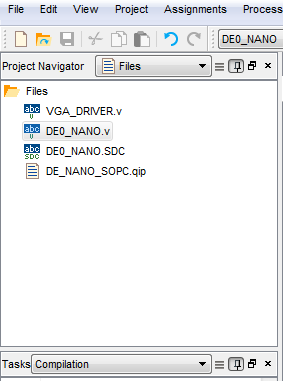
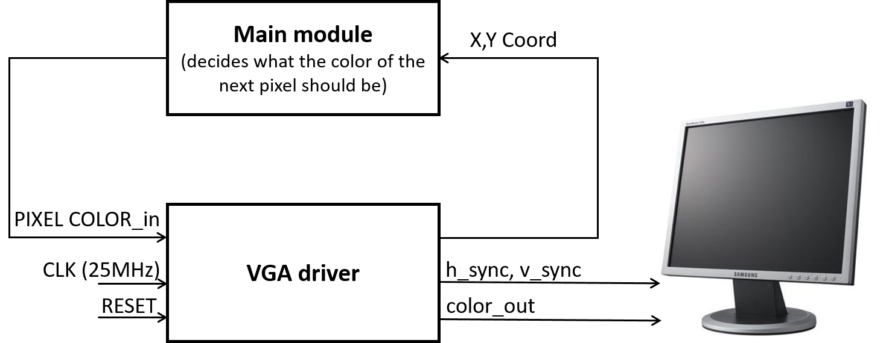
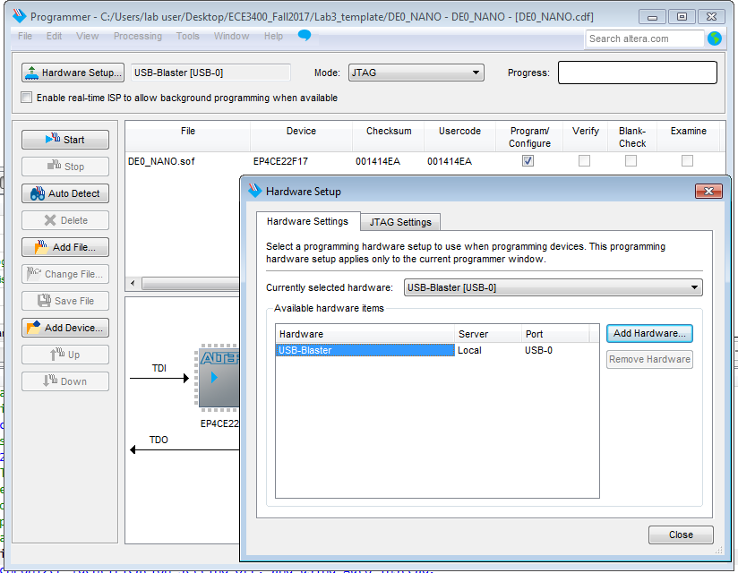

# ECE3400 Fall 2017
## Lab 3: FPGA Video Controller and Sound Generation

## Objective
This lab is divided into two. One (half-) team will take at least two external inputs to the FPGA and display them on a screen. The other team will react to an external input to the FPGA of their choice and generate a short 'tune' consisting of at least three tones to a speaker. 

Both of these tasks will help towards the design of the final system. In the final competition, all maze information discovered by the robot must be transmitted from the basestation Arduino to the FPGA, and then drawn on a VGA monitor. Once the maze has been completely mapped, the FPGA must generate a short tune to be played on a speaker to signify that the maze-mapping is done.

## Pre-lab Assignment

* This lab is likely to be the most time consuming, be sure to set off adequate time to complete this and agree on the sub-teams before coming to the lab. 

* We will be using a DE0-Nano Development Board. Its documentation can be found [here](http://www.terasic.com.tw/cgi-bin/page/archive.pl?Language=English&CategoryNo=165&No=593&PartNo=4). You should skim this to have an idea of when to use it before the lab. 

* You will use Altera’s Quartus II software to program the FPGA. While there will have been a review of Verilog in class, it is highly recommended that you review how to program with Verilog. Both sub-teams should download the example Quartus project [here](./Solutions/lab3/Lab3_template.zip).

* You should also carefully read the different tasks you will be completing below.

* As always it is a good idea to check [Team Alpha's website](https://cei-lab.github.io/ECE3400-2017-teamAlpha/) to see an example of a solution. But please strive to do better than we did!

### Graphics Team

In this lab you will begin the task of building a fully-functional base station for your robot. You will do this by writing a VGA controller to display graphics on a VGA monitor using an FPGA. The graphics you must display in this lab will be a simplified version of the final maze grid. The state of this grid will be controlled by an Arduino Uno, and any changes made to the grid with the Arduino must be conveyed to the FPGA and displayed graphically. 

To do this, you will need to familiarize yourself with the DE0-Nano FPGA development board, develop a system for transferring image information from the Arduino to the FPGA, and learn how to interact with the video memory and VGA driver.

Look at the [template code](./Solutions/lab3/Lab3_template.zip) for the VGA driver, also linked above. A VGA screen is driven by two synchronization signals and three analog color inputs. It works by looping through all the pixels on the screen, as determined by the synchronizing clock signals. In each clock cycle, the color of the corresponding pixel is determined by the voltage on the three analog signals (red, green, blue). 

The VGA driver module on the FPGA generates the necessary VGA color signals (8-bit RGB color: 3 bits for red, 3 bits for green, and 2 bits for blue) and the synchronization signals. It also outputs the x- and y-coordinates of the next pixel that is needed which you will use to determine what the color of that pixel should be. It only has one modifiable input - which is the color that corresponds to the next pixel location. A clarifying diagram is shown in the procedure section. 

The VGA cable connecting to the monitor only has one wire for red, one wire for green, and one wire for blue. These are analog cables (they take values from 0 to 1 V). We have provided a Digital-to-Analog-Converter (DAC) that converts the 8 given color bits (with a 3.3V digital output from the FPGA) to the desired three color 1V analog signals.

Your work in this lab is the foundation for the final basestation, so it will be helpful in the long run if you think carefully about how you choose to represent your maze. Spend time thinking about an efficient method of storing the maze data to be displayed. 
Two important considerations are timing and space: you need to be able to access pixel colors quickly, edit them quickly, and have enough space in FPGA memory to hold all of the pixel values. You will need to represent both the full maze (4 by 5 squares) and walls, empty spaces, unexplored spaces, a robot, and treasures within it. Be sure to include a description of your plan on your team website.

*Note: Be sure to agree on a coordinate system to use for your grid _with the entire team_ - speaking from experience, this will save a lot of time when debugging.*

### Acoustic Team

You will use the FPGA to generate a short tune containing at least three different frequencies. This tune will play when the FPGA recieves a done signal from the Arduino on the robot. We will use standard speakers provided in lab to play your generated sound. Generating sound using an FPGA requires careful consideration of the clock frequency of the overall system to generate waveforms of a desired frequency. There are many different waves you can generate using the FPGA, including square waves, triangle waves, sawtooth waves, and sine waves. All of these waves create tones with different timbres. Feel free to experiment with different waves to see which one you like the best. Keep in mind that for this lab, the tones you generate must use the 8-bit DAC to connect to the speaker. 

## Documentation
Throughout this lab and ALL labs, remember to document your progress on your website. Add anything that you think might be useful to the next person doing the lab. This may include helpful notes, code, schematics, diagrams, photos, videos, and documentation of results and challenges of this lab. You will be graded on the thoroughness and readability of these websites. 

Be sure to note on the website what work is carried out by whom. And remember that, if at all possible, you are expected to form different sub teams in every lab.

***

## Procedures

Both sub-teams will need the following materials:

* Arduino Uno
* FPGA DE0_nano

*Note: Be aware that your team only gets to keep one of the FPGAs after the lab is over. We do not have enough for every team to keep two FPGAs!*

### Graphics Team

You need the following additonal materials:
* 1 VGA screen
* 1 VGA cable
* 1 VGA connector
* 1 VGA switch
* Various resistors

#### Setup: Open Quartus and understand example code

Download Lab 3 example code and open Altera Quartus Prime Lite Edition. Open the Quartus Project File (.qpf) and use the project navigator in the top-left corner of Quartus to view all the files in the project.

You should see two .v files:

* DE0_NANO.v : The top-level module, which connects to the system clock as well as several other peripherals like on-board LEDs, switches, the two buttons, and both banks of GPIO pins. All your main logic will go in this file. Feel free to write your own modules and instantiate them here.
* VGA_DRIVER.v : Module that outputs VGA sync signals. One instance of this module has already been instantiated in the top-level module and connected to a series of GPIO ports.

The block diagram below shows how these two modules interact with each other. 

Read through both files to understand how each works. Try to figure out what you should see when you program the board. 

You'll also need a VGA connector, which connects to several GPIO pins on the FPGA. Connect it to the FPGA, then use a VGA cable to connect the FPGA to the VGA switch. You'll be able to use the switch to toggle between VGA input from the computer and from the FPGA.

Now, compile the project by going to Processing > Start Compilation. Once the project is done compiling (this could take about 30 seconds), program the board by selecting Tools > Programmer. In the Programmer window that pops up, make sure the USB-Blaster is selected, and then hit start to program the board. You should see a green screen on the VGA monitor and LED0 blinking. 

#### Simple drawings

To better understand how the VGA driver works, try changing the background color and drawing a square on the screen.  

#### Design and code a memory system to draw blocks in a grid

Now that you can draw a square, it's time to think about how you will draw an entire maze. 

Begin by simplifying the problem - rather than trying to draw a 4x5 maze, start with something like a 2x2 grid. You'll need to think about how to display information about each block in the grid without storing the color of each pixel in that grid. With the given VGA driver code, create a system that stores grid information and relays the relevant pixel information to the VGA driver when it is requested. 

The first step is to determine how you can store all the necessary information on the FPGA (memory is limited). There are many ways you can do this and some even allow the use of higher resolution color. 

After coding the pixel memory system, integrate it with the display driver that you already have. The driver requests colors by screen location and it is up to you to interpret what that means to your storage system. To test your system, hard-code data into your memory system. 

*Hint: It may be helpful to use the on-board LEDs for debugging purposes.*

#### Create a communication method between the Arduino and the FPGA:

Create a system to pass information from the microcontroller to the FPGA using the digital ports on both of these devices. You can send the information serially or through a parallel bus, but be sure to consider timing and other concerns when determining this. **Be aware that the DE0-Nano operates at 3.3 Volts, but the Arduino Uno outputs 5 volts on its digital pins.** Therefore, you will need to have a voltage divider for each wire connected from the Arduino to the FPGA. You will also need a common ground. Confirm with the TA’s that your choice of resistors is adequate before hooking everything up.

The final step is to create a protocol for the information that is being sent, and to interpret the information on the FPGA’s side of communication. The FPGA should be able to use the data to modify the image on the display screen. (Examples of different state changes would include: highlighting a square in the grid, clearing the screen, drawing a wall in a location, drawing a free space in a location, etc.)

### Acoustic Team

You will need the following additional materials:
* Lab speaker
* Stereo phone jack socket
* 8-bit R2R DAC

#### Generate and play a square wave of a desired frequency

A square wave is the simplest waveform you can generate to produce sound. Toggle a GPIO pin at a frequency of your choosing. Verify that the waveform is correct by viewing the signal on an oscilloscope. After you're sure the waveform looks correct, connect this GPIO pin to one or both inputs of the phone jack socket (the center pin on the socket is ground) and plug the speakers in to listen to your sound.

#### Generate a more complicated waveform and play sound using the 8-bit DAC

Now that you know how to generate a simple square wave, choose a more complicated waveform to generate (sawtooth, triangle, sine). We are using an 8-bit DAC, so the highest value you can give it is 255, which corresponds to a 3.3V output from the DAC.

The datasheet for the available DAC is [here](http://www.bourns.com/docs/Product-Datasheets/R2R.pdf).

#### Turn on/off your sound with an enable signal

Try switching your sound on and off using a switch on the FPGA board or using a signal from the Arduino.

#### Make a tune with at least three frequencies that plays when you recieve a done signal from the Arduino

Finally, generate at least two more audibly distinct frequencies to create a short tune. The tune should play only when a done signal from the Arduino is recieved by the FPGA.

#### If you finish early...

...continue working on Milestone 2 which is due next week!

***

### Wrap-Up and Clean Up
Keep all circuitry and materials relevant to the video controller in your box. Do not keep USB A/B cables or computer monitors in your box. Remember to hand back the FPGA used for the acoustic team. All other components can be placed back into their appropriate bins. Clean up your station thoroughly before you leave!

You should document this lab thoroughly on the website, feel free to add ideas/comments this lab inspires regarding your future robot; the TA's will check the website by the end of the following week. Remember to have a TA note your attendance before heading out.

Use GitHub on the computer to upload and save your code, be sure to add appropriate commit messages. The lab computers will NOT keep any data locally (i.e., on them). Once you log off, the data will eventually be lost (typically overnight). Save your data on a flash drive or other means before you leave the lab.
