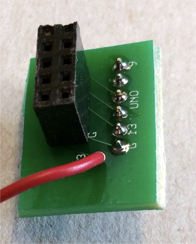
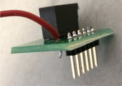

# Lab 4: Radio Communication and Map Drawing
## ECE 3400 Fall ’17

### Objective
In this lab, you will be working on the final major component of your project: radio communication. You will also extend the work you did in Lab 3, using the FPGA to draw a full maze on a VGA monitor and update it with information received from the radio.

Before the lab, split your team into two groups. One group will work on the radio component and the other on the FPGA component. Preferably, the FPGA group will *not* contain the group members who did the maze drawing component of Lab 3. We would like everyone to get experience with the VGA elements of this course. Note that the each group has it own pre-lab assignment.

For the final portion of the lab, the work done with the radio will be combined with the work done with the FPGA. Using the Nordic nRF24L01+ transceivers and the corresponding Arduino RF24 library, you will get the robot and video controller to talk to each other. You should ideally be able to send messages from one Arduino to the other Arduino (simulating actual maze information) and have the FPGA display the received data on the monitor.

### Documentation
Throughout this lab and ALL labs, remember to document your progress on your website. Add anything that you think might be useful to the next person doing the lab. This may include helpful notes, code, schematics, diagrams, videos, and documentation of results and challenges of this lab. You will be graded on the thoroughness and readability of these websites.

Remember, all labs are mandatory; attendance will be taken at every lab. All labs will require you to split into two sub-teams, so be sure to note on the website what work is carried out by whom.

***

## Radio Group

### Materials
- 2 Nordic nRF24L01+ transceivers
- 2 Arduino Unos
- 2 USB A/B cables
- 2 radio breakout boards with headers





### Pre-lab Assignment
This lab will use the RF24 Arduino library. Before you start the lab, look over the reference page (http://maniacbug.github.io/RF24/classRF24.html) and review the primary public interface methods at the top of the page. Make sure that you understand what they do at a high level.

If you are sending a 2-dimensional (3x3, for example) array of chars, what is the size of the array in bytes? Compare this to the maximum payload size of the radio. How many packets are required to send the 3x3 char array?

Now assume that each element in the array has a maximum value of 3. How many bytes can you compress this array into, now that you know this piece of information? How many packets are now required to send the array?

### Procedure
**Getting Started**

Plug your radios into your Arduinos using the special printed circuit boards. Wire the radio to the 3.3V pin on the Arduino.


Download the [RF24 Arduino library](https://github.com/maniacbug/RF24). Add it to the Libraries folder in your Arduino directory. *Note:* Do not update this library if the Arduino asks you to do so. The update will break the example code used for this lab.

Download the "Getting Started" sketch from the course GitHub repository for Lab 4. Do NOT use the "Getting Started" sketch included in the RF24 library. Replace the Getting Started code in the RF24 library example folder with the one you downloaded from the course GitHub.

Change the identifier numbers for the two pipes to the ones assigned to your team using the following formula:

```
2(3D + N) + X
```

where D is the day of your lab (0 = Monday day, 1 = Monday night, 2 = Wednesday night, 3 = Friday) and N is your team number. X is 0 for one radio and 1 for the other (you need 2 identifiers, which is why this X is included in the formula).

Example: You are Friday Team 9. And so, D = 3, N = 9, and your identifier numbers are then:

2*(3*3 + 9) + 0/1 = 36 and 37 in decimal = 24 and 25 in hex.

You will put these channel numbers (with leading 0s) in the line of code that says

```C
const uint64_t pipes[2] = { 0xF0F0F0F0E1LL, 0xF0F0F0F0D2LL };
```


so that it instead says

```C
const uint64_t pipes[2] = { 0x0000000024LL, 0x0000000025LL };
```

The LL’s mean “long long,” or a 64-bit number. Leave these in.

Program the sketch onto *both* of your Arduinos. If you like, you can use two PC's, one for each Arduino, so that you can open a serial monitor for each simultaneously. Otherwise, you can use a single PC and switch the serial monitor between the two.

Choose one Arduino to be the transmitter and open the serial monitor for it. Type in “T” and hit enter. This will put it in Transmit mode. You should see this Arduino sending a timestamp. Switch to the serial monitor for the other Arduino and you should see it printing the received message.

Once this is working, do some quick experiments with range and channel number. How far do the radios work at the chosen power level? Do you have any dropped packets? Is there any interference?

*Note:* If you wish to try different power levels, note that the commented values are INCORRECT. The enum names are “RF24_PA_MIN, RF24_PA_LOW, RF24_PA_HIGH, and RF24_PA_MAX.” There is no MED value that the code mentions.

Make sure you understand the "Getting Started" sketch at a high level; it is suggested that you use this sketch as a building block for your own radio code. If you have any questions, ask a staff member.

**Sending Maze Information**

We will now do two exercises for sending maze information, one where the entire maze is sent and one where only new information is sent.

**Sending the Entire Maze**


The most intuitive way of representing an entire maze is with a two-dimensional array. Use this 2D char array as an example:

```C
unsigned char maze[5][5] =
{
3, 3, 3, 3, 3,
3, 1, 1, 1, 3,
3, 2, 0, 1, 2,
3, 1, 3, 1, 3,
3, 0, 3, 1, 0,
};
```


Modify the Getting Started sketch to send, receive, and display the array using the Serial Monitor. You can choose to pack the array (since the values only go up to 3) or to send them as chars.

Keep in mind the number of packets you expect to receive and think of a way to correct behavior if a packet is dropped. For example, if you expect to receive 8 packets but only receive 7, then when the first packet comes of another maze update, you’ll think it’s actually the 8th packet and be one off on your counting after that. The RF24 library has an Auto-ACK feature – look at the details of this and think of how enabling or disabling it would affect how you send and encode packets. *Note:* It is enabled by default.

**Sending New Information Only**


If you do not want to send the entire maze, an alternative is only sending new information. This may seem a trivial optimization, but in real-world robotics, power consumption is an unavoidable technical limitation. Wasting energy sending superfluous data over radio is shoddy engineering at best.

Take this code for an example on sending only new maze information:

```C
int x_coord = 3;

int y_coord = 2;

char data = 2;
```


As in the first exercise, modify the Getting Started sketch to send, receive, and display the sent information using the Serial Monitor.

Keep in mind though that even if one method may seem easier to implement, there may be unexpected overhead in other elements of the project. Ask yourself how your choice for this portion of the project affects the robot’s logic as well as the video controller logic. What happens if a packet is dropped? Again, how will enabling the Auto-ACK feature affect this?

**Sending robot position**

The FPGA team has been working to draw a grid that shows the current position of the robot. To do this, they will need you to relay a coordinate position to them over the radio.

Implement a communication method to send the current position of the robot from one Arduino to the other. Design for a 4 x 5 maze and decide on the appropriate coordinate system to use.

Your goal is to send the current position of the robot from Arduino A to Arduino B. Then Arduino B will transfer that information to the FPGA so that the current position of the robot appears on the VGA monitor.

***

## FPGA Group

### Materials
- FPGA
- Various resistors
- 1 VGA cable
- 1 VGA connector
- 1 VGA switch

### Pre-lab Assignment

### Procedure

#### Display the full-sized 4x5 grid

You should already have code from Lab 3 which displays a smaller version of the maze grid on the VGA monitor using the FPGA. For this lab, you will modify this code to display the full 4x5 grid on the VGA monitor. Additionally, you will get an Arduino communicating with the FPGA so that your Arduino can receive messages about the maze from the robot and display that information on the monitor.

#### Recieve packets from the Arduino

Using the packet format that you have agreed on with the radio team, write a module to read packets from the Arduino. For this lab, packets do not need to be large since you only need to display the robot's current location; however, keep in mind that for the final competion, packets must carry much more information than just the robot's location. For this reason, it might be worthwhile to spend some time thinking about the best method for transmitting data from the Arduino to the FPGA even if that means changing your implementation from lab 3. To test your packet reciever, consider using the on-board LEDs.

#### Highlight the robot's current location based on packet information

Now that you can recieve packets, parse this data and use it to display the robot's current location in the 4x5 grid.

#### Mark explored territory

Finally, add additional code to

***

### Wrap-Up
Keep all relevant parts of this lab in the box dedicated for your team. All other components, including USB cables, can be placed back into their appropriate bins.

Before leaving the lab ask one TA to confirm that your box only has 2 Arduinos, 2 Breadboards, and no tools.

You should have documented this lab in your notebook; your documentation should include personal notes, challenges, successes, and applicable diagrams.

Use the GitHub program on the lab computer to save your code.
