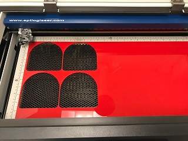
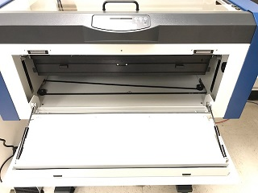
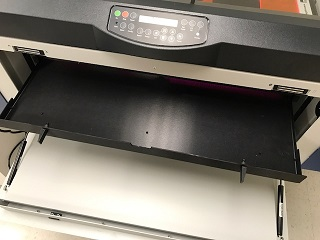
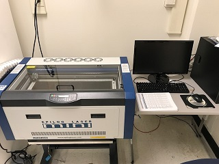
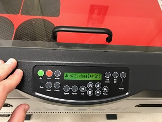
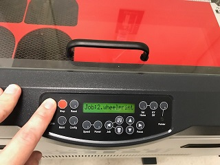
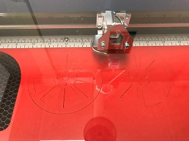

# Laser Cutting Tutorial
## Uses for Laser Cutting
Laser cutting is good for rapidly making 2D parts. Using the laser cutter, you can both cut through and etch designs into your chosen material. Laser cutting is both faster and more accurate than 3D printing, but limits the design to 2 dimensions. Different materials can be used as well, such as acrylic, wood, or cardboard.
## Creating Files for Laser Cutting
### Design must be 2D
Your part must be able to be represented in 2D. The laser cutter is only capable of making cuts and etching designs into a sheet of material.
### Export your design as a .dxl file
While the .dxl file is preferred, image files and pdfs are also able to be printed, although these require more work to setup.
## Preparing Files for Laser Cutting
### 1. Run Corel and set up a page with the dimensions of your material
This gives you the total area you have to cut from. If there are already cuts in the material, you can drag the rulers on the side of the screen to designate areas you don't want to cut. The laser cutter will ignore all etches/cuts you place in this area.

### 2. Import your file into Corel
In addition to .dxl files, you can import pdf and image files as well, although these may require some adjustments to work with the laser cutter. Most parts imported from .dxl files are broken up into individual lines. If you want to manipulate the part as one piece, select all the lines, right click and click on group.

### 3. Place your part onto the area of the page you want to cut from
Make sure you place you part on an area that has not already been cut from. If you want to make multiple copies of your part, you can use ctrl+c and ctrl+v to copy and paste your part onto the page.

### 4. Check that all cuts and etches are properly set
Any line that you want cut needs its width to be set to hairline, otherwise the line will be etched. Anything solid black, such as text or a filled in silhouette, will be etched.

### 5. Ensure that the laser is configured properly
When you are satisfied with the layout of your part, click on print. On the print menu select print preferences. This will bring up the configuration menu for the cutter. *Make sure autofocus is on and the piece size dimensions match the page size.* Select the proper settings for vectoring and rastering. Vectoring refers to cutting through the material while rastering is etching. Look at page 141 of the Laser cutter manual to find the proper settings for the material you are using.

### 6. Print your part
Once you have entered the proper settings for the laser, click print to send your job to the cutter. Make sure that the laser cutter is on and ready for printing before sending a job to it. Also make sure there are no issues with the print.

## Safety
### 1. Never use polycarbonate or PVC in the laser cutter
Polycarbonate will burn and could start a fire in the laser cutter. If you notice thick black smoke coming from the laser, open the lid to shut off the laser. PVC will emit chlorine gas when it is cut, which can seriously injure or kill those who inhale it.
### 2. Never leave the laser cutter unattended while it is cutting
Someone must be present while the laser cutter is operating in order to shut it off in the case of an emergency.
### 3. Open the glass cover to immediately stop the laser
Once the lid is opened, the laser is immediately turned off, although the laser lens may still move along its path.
### 4. Use the manual to determine the laser settings for your material
On page 141 of the laser cutter manual there is an appendix that lists the recommended settings for the laser based on the material that is to be cut. Use these settings, and be especially careful with flammable material such as wood or cardboard.
## Using the Laser Cutter
### 1. Clean the laser's lens
Use the lens cleaner and wipes located next to the laser cutter to clean the lens. A q-tip can also be used to clean the lens more thoroughly.
### 2. Place your material into the laser cutter
Open the lid of the laser cutter and place your material onto the tray. Make sure it is secure and does not wobble around or move easily.

### 3. Empty the tray underneath the laser cutter
1. Pull on the two handles on the front of the laser cutter to open the laser cutter.

2. Open the two latches used to keep the tray in place, then use the latches to pull out the tray.

3. Dispose of any debris left in the tray, then return the tray into the laser cutter, closing both latches when it is securely in place.
4. Close the front of the laser cutter.        

### 3. Turn on the laser cutter
The laser cutter's power switch is located on left side of the laser cutter, near the ventilation duct.
### 4. Send your job to the laser cutter
After you have loaded your part onto the computer and configured it with Corel, print the part. After the you click print, the job number and name of the file should appear on the laser cutter's display.

### 5. Turn on the laser cutter's fan
The fans can be turned on by flipping a red switch on the surge protector to the left of the laser cutter. The pump and fans will make a loud noise to indicate they are on.

### 6. Begin your print
Press the green "GO" button to start the loaded job. The laser cutter will then cut out the part and return to the top left corner when it is done. When taking your part out the laser cutter, don't worry about any small pieces that fall through the honeycomb, there is a tray underneath that collects falling parts.

