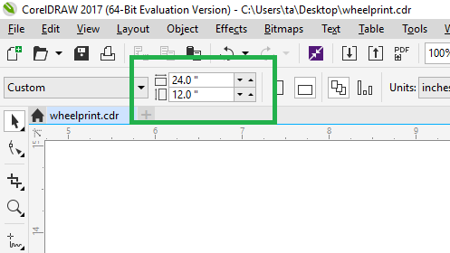
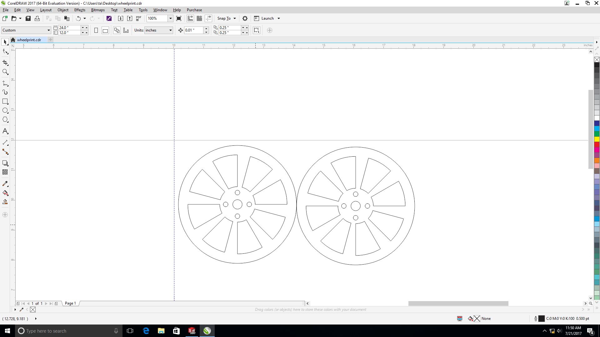
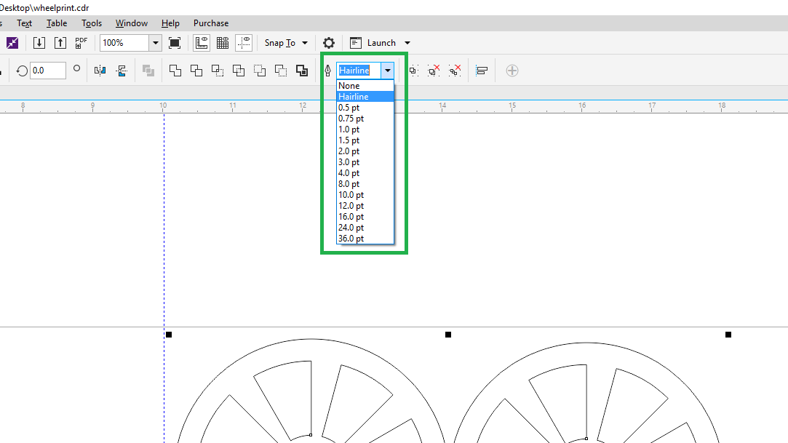
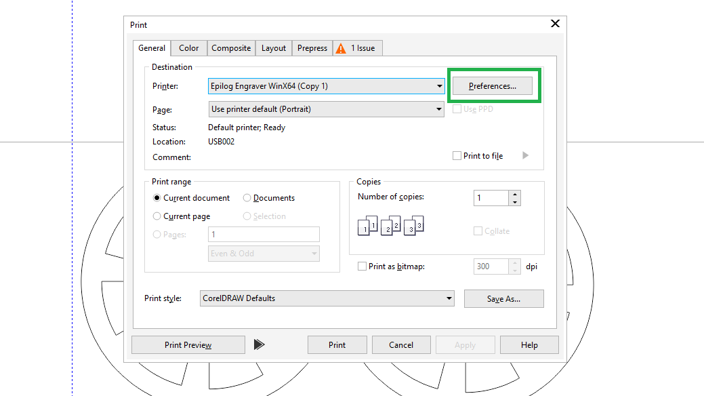
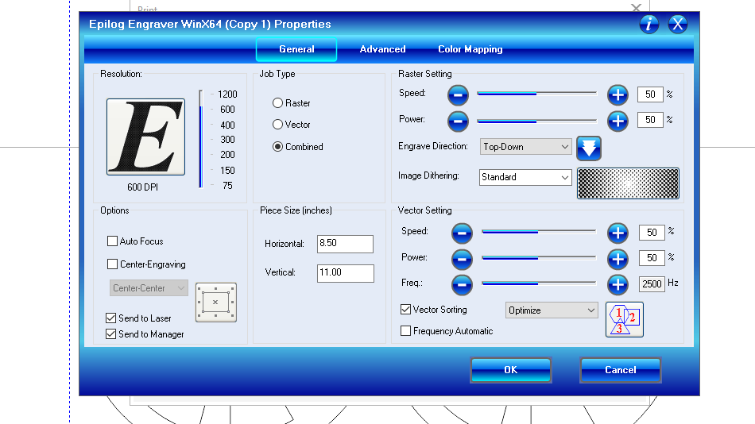
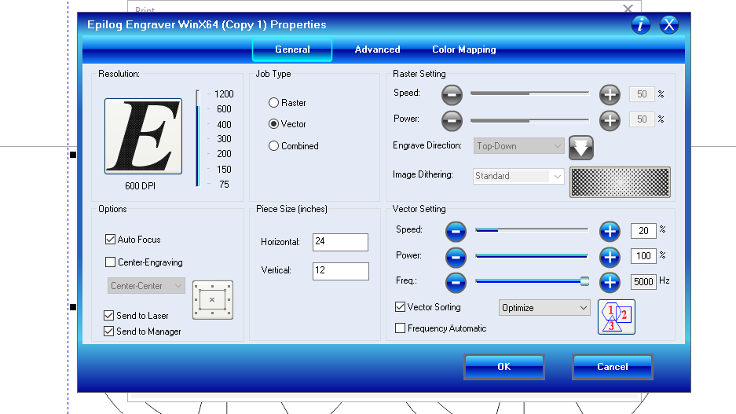
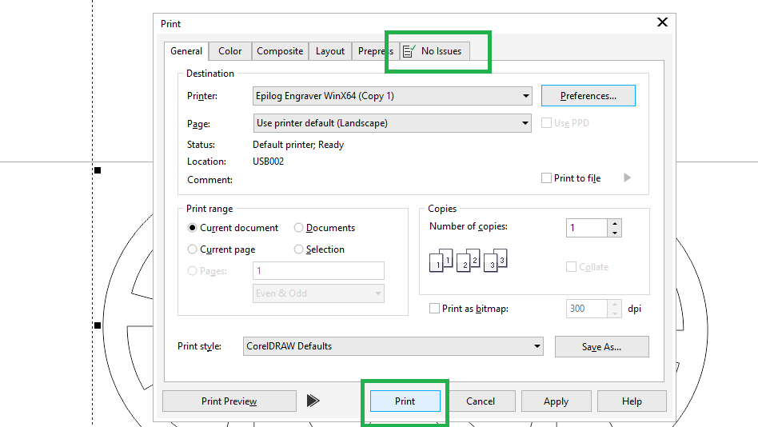

# ECE3400 Fall 2017

## Using the Epilog 24 Mini Laser cutter
*By Christopher Fedors, July 30th 2017*

Laser cutting is the perfect tool for rapidly making 2D parts or parts where many flat sheets can be welded together. Using the laser cutter, you can both cut through and etch designs into your chosen material. Laser cutting much faster and often more accurate than 3D printing. Different materials can also be used, such as acrylic, wood, or cardboard.

We have an [Epilog 24 Mini](https://www.epiloglaser.com/products/legend-laser-series.htm) available in PH414. Access to this laser cutter is restricted to TAs for the time being, please ask them if you would like something cut. The maximum dimensions you can cut in this cutter is 1 by 2 feet. It can easily cut through 1/4" sheets of acrylic or wood. 

Alternatively, you can visit the [Rapid Prototyping Lab](http://cornellrpl.wixsite.com/cornellrpl) and ask if they have time to help you. Their cutter can handle sizes up to 2 by 4 feet.

## How to design parts for a laser cutter

Detailed information on good design strategies for laser cut pieces can be found [here](Design_for_laser_cutters.m). This page also has information on what glue to use to combine multiple pieces.

*Your part must be represented in two dimensions.*

If you are looking to cut out a piece of material you'll need to generate a vector drawing with lines of 0 (hairline or minimum) thickness. This is typically done by exporting your file as a .dxl. If you are looking to raster a drawing into a sheet, you can use image files or PDF's.

The color of your lines will correspond to a different cut/raster setting. If your part has both an outline and internal holes, for example, it makes sense to draw these in two different colors. You can then cut along the color that defines the inside holes first, then the outside. (Once a piece has been cut, it can shift slightly on the plate, and so internal holes may shift compared to the outline if these are cut last.)

## Preparing Files for Laser Cutting in Corel Draw

### 1. Run Corel and set up a page with the dimensions of your material
This gives you the total area you have to cut from. If there are already cuts in the material, you can drag the rulers on the side of the screen to designate areas you don't want to cut. The laser cutter will ignore all etches/cuts you place in this area.

### 2. Import your file into Corel
In addition to .dxl files, you can import pdf and image files as well, although these may require some adjustments to work with the laser cutter. Most parts imported from .dxl files are broken up into individual lines. If you want to manipulate the part as one piece, select all the lines, right click and click on group.

### 3. Place your part onto the area of the page you want to cut from
Make sure you place your part on an area that has not already been cut from. If you want to make multiple copies of your part, you can use ctrl+c and ctrl+v to copy and paste your part onto the page.

### 4. Check that all cuts and rasters are properly set
Any line that you want cut needs its width to be set to hairline, otherwise the line will be rastered. Anything solid black, such as text or a filled in silhouette, will be rastered.

### 5. Ensure that the laser is configured properly
* When you are satisfied with the layout of your part, click on print. 
* On the print menu select print preferences. This will bring up the configuration menu for the cutter. 
* **Make sure autofocus is on and the piece size dimensions match the page size.** If the laser is not focused it can mess up your part, and in the worst case run the head of the laser into the base plate breaking the cutter. 
* Select the proper settings for vectoring and rastering. Look at page 141 of the Laser cutter manual to find the proper settings for the material you are using.

Here is a table with some common settings. If you find a good setting, please let us know so that we can add it.

CHRISTOPHER PLEASE ADD SETTINGS FOR 3MM AND 6.35MM ACRYLIC, CARDBOARD, PAPER

Alternatively, to find the right settings for a new material start with a high speed and low power. Then incrementally lower the speed and increase the power until the laser cuts through completely. If your material keeps igniting, try increasing the speed. You can also ensure that cuts are not too close together to keep the area from heating up. When operating with a thick material, you make have to cut twice. 

Acrylic typically has a scratch-proof paper backing. It is fine to leave this backing on while you are cutting to protect the material. However, if you are cutting many pieces it may take a long time to remove it afterwards. 

### 6. Print your part
Once you have entered the proper settings for the laser, click print to send your job to the cutter. Make sure that the laser cutter is on and ready for printing before sending a job to it. Also make sure there are no issues with the print.

## Safety

### 1. NEVER leave the laser cutter unattended while it is cutting
Someone must be present while the laser cutter is operating in order to shut it off in the case of an emergency. If we find that anyone has left the cutter unattended, they will immediately loose all priviliges to the cutter for the remainder of the semester.
### 2. NEVER use polycarbonate or PVC in the laser cutter
Polycarbonate will burn and could start a fire in the laser cutter. If you notice thick black smoke coming from the laser, open the lid to shut off the laser. PVC will emit chlorine gas when it is cut, which can seriously injure or kill those who inhale it. Styrofoam and poster boards fall into this category.
### 3. NEVER cut metal in the laser cutter
Metal will reflect and scatter the laser beam. Not only will your piece not get cut, the reflected beam may severely damage the internal parts of the laser.
### 4. Open the glass cover to immediately stop the laser
Once the lid is opened, the laser is immediately turned off, although the laser lens may still move along its path.
### 5. Use the manual to determine the laser settings for your material
On page 141 of the laser cutter manual there is an appendix that lists the recommended settings for the laser based on the material that is to be cut. Use these settings, and be especially careful with flammable material such as wood or cardboard. 
### 6. Cutting paper/cardboard
Flammable materials such as paper and cardboard will cause a small flame to appear under the laser. As long as this flame is small and temporary (stops when the laser leaves the area), this is fine. If the paper keeps burning, you have to adjust your settings!
### 7. IF YOU BREAK SOMETHING
The laser cutter will receive heavy use. If you break something or notice that something is broken, it is imperative that you contact your TAs or the professor immediately. 

## Using the Laser Cutter

### 1. Clean the lens of the laser
Use the lens cleaner and wipes located next to the laser cutter to clean the lens. A q-tip can also be used to clean the lens more thoroughly. 

### 2. Place your material into the laser cutter
Open the lid of the laser cutter and place your material onto the tray. Make sure it is secure and does not wobble around or move easily.

### 3. Empty the tray underneath the laser cutter

* Pull on the two handles on the front of the laser cutter to open the laser cutter.

* Open the two latches used to keep the tray in place, then use the latches to pull out the tray.

* Dispose of any debris left in the tray, then return the tray into the laser cutter, closing both latches when it is securely in place.
* Close the front of the laser cutter.        

### 3. Turn on the laser cutter

The laser cutter's power switch is located on left side of the laser cutter, near the ventilation duct.

### 4. Send your job to the laser cutter

After you have loaded your part onto the computer and configured it with Corel, print the part. After the you click print, the job number and name of the file should appear on the laser cutter's display.

### 5. Turn on the laser cutter's fan

The fans can be turned on by flipping a red switch on the surge protector to the left of the laser cutter. The pump and fans will make a loud noise that indicates that they are on.

### 6. Begin your print

Press the green "GO" button to start the loaded job. The laser cutter will then cut out the part and return to the top left corner when it is done. When taking your part out the laser cutter, don't worry about any small pieces that fall through the honeycomb, there is a tray underneath that collects falling parts. **Be careful not to bump the material against the head of the laser!**

