# ECE3400 Fall 2017
## Soldering Tutorial

*By Christopher Fedors July 20th, 2017*

## Soldering Safety

### 1. Always wear safety goggles while soldering
This is important, as solder sometimes has a tendency to spurt, sending small droplets of molten solder into the air. Since the droplets are small, they do not generally cause damage to the skin or clothes, but have the potential to cause serious damage to unprotected eyes.

### 2. Be careful with the soldering iron
The tip of the soldering iron can get as hot as 700 degrees during use, which can cause serious burns to skin and melt most plastics. This means that caution must be observed when handling the iron. If you have long hair, tie it behind your head. Don't wear loose jewelry and roll up long sleeves when soldering.

### 3. Do not touch wires/parts that are being soldered
Metal objects like wires and resistor leads conduct heat very well, and may be heated several hundred degrees by the soldering iron, which can lead to severe burns.

### 4. Wash your hands after soldering!
Always wash your hands after finishing in the lab. Remember that eating is never permitted in the lab; neither are open drinking cups.

## Four Easy Steps to Soldering
### 1. Secure the joint that needs to be soldered
Ensure that the parts or wires that need to be soldered are held securely in place. Devices like clamps, vices, or tape can help with this. Ensure that nothing sensitive to heat is touching the area that is going to be soldered.

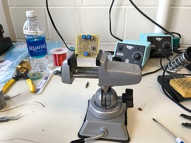
### 2. Get the iron ready
Turn on the iron and set the temperature to 700&deg;F (370&deg;C), and give it around a minute to warm up. Next clean the tip of the iron by wiping it on a wet sponge. If the tip is very dirty you can also wipe it on a metal sponge, and use tinner to improve the heat conduction again. A shiny iron leads heat well, a matte iron does not conduct heat very well and will be harder to use.

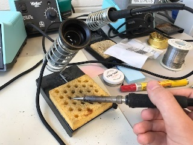
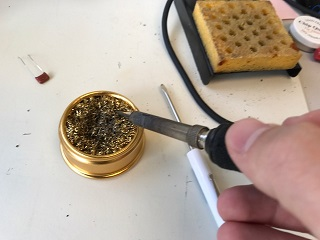

### 3. Solder the connection
Hold a strand of solder in one hand and the soldering iron in the other. Place the iron on the joint you want to solder and feed the solder onto both the pin and the board. The solder should melt as it touches the iron/joint. The solder is what conducts the heat, i.e. if you only apply solder to the iron it will not lead the heat from the iron onto the pin and will not flow onto the joint. 
Apply enough solder so that the connection is mechanically and electrically stable. Applying too much solder can make a connection difficult to desolder, so be careful not to use too much. Applying heat for too long can lead to damages of both the component and the board.

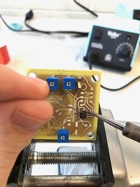

### 4. Evaluate
A good solder joint should be shiny and cone shaped. If the joint is dull, it is the result of "cold solder," which occurs when molten solder is added to the joint, instead of being melted onto the joint itself. If the joint is blob shaped, electrical connection is not guaranteed, it may work briefly only to break as soon as a vibration occur. It also might cause a short circuit so be sure to always check for shorts after you are done.

Example of Good Solder Joint:

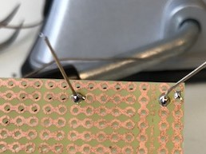

Example of Poor Solder joint:

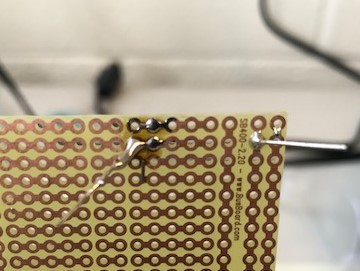

# Desoldering Tutorial
## Safety

### 1. The same safety rules for soldering apply to desoldering
Always wear safety goggles/glasses, be careful with the iron, and don't touch anything while it is being desoldered

### 2. Do not touch the braid while desoldering
Since braid is made of finely woven copper, it conducts heat very well. This means that when the braid touches the iron, it heats up very quickly and will burn your hands if you are holding on to it. Use tweezers to hold the braid instead.

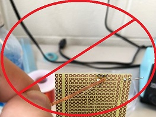
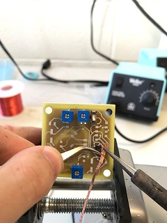

## Four Easy Steps to Desoldering Using Braid

### 1. Secure the joint that needs to be desoldered
Ensure that the parts or wires that need to be desoldered are held securely in place. Devices like clamps, vices, or tape can help with this. Ensure that nothing sensitive to heat is touching the area that is going to be desoldered.

### 2. Get the iron ready
Turn on the iron and set the temperature to 700&deg;F (370&deg;C), and give it around a minute to warm up. Next clean the tip of the iron by wiping it on a wet sponge.

### 3. Desolder the connection
Get a clean strand of braid to desolder with. Pick up a strand of braid with a pair of metal tweezers in one hand and pick up the soldering iron with the other. Use the tweezers to press the braid onto the area to be desoldered, then apply the soldering iron onto the braid. After a short amount of time, the solder should melt and be absorbed by the braid. Be careful not to keep the iron on the connection too long, as you run the risk of burning the parts/board you are trying to desolder. Excessive heating may also cause the traces to delaminate from the PCB. It is often best to wait a couple minutes between desoldering attempts to give the parts and board a chance to cool down.

### 4. Evaluate
How much solder is still left on the joint? Sometimes multiple attempts need to be made to get all the solder off of a connection. Sometimes it helps to add more solder to a joint you are trying to desolder. Also check that while desoldering, you did not inadvertently solder or desolder other connections on the board.

# Extra Soldering Techniques
## What Type of Wires to Use
While solid wires are easier to use on breadboards, stranded wires are often better for soldering. This is because stranded wire both soaks up solder better than solid wire, as well as being less susceptible to fatigue. This means that solder joints made with stranded wire often last longer and are easier to make.

## Tinning Stranded Wire
One downside to stranded wire is that it can fray, making it difficult to fit the wire through holes in solderboard or PCBs. To deal with this, it helps to twist the exposed wire to get it into a cylindrical shape and then "tin" it, which means to apply some solder to it. The tinning helps the stranded wire keep its shape and prevents fraying. The best way to tin the wire is to mount the wire such that the exposed tip points upwards. Then apply the iron at the tip of the wire along with a bit of solder to lead the heat. Next apply the solder at the base where the insulation starts. When it melts the solder will flow up towards the source of the heat, but some will be pulled downwards due to gravity. The solder that flows under the insulation helps strengthen the wire from damage that may have occurred when the insulation was stripped off.

## How to Change a Soldering Iron's Tip
1. Ensure the solder iron is turned off and has had time to cool down. If the iron has been in use recently, give it 10-15 minutes to cool off. It helps to wipe the iron on a wet sponge to get it to cool faster.

2. Unscrew the metal ring where the metal part of the iron connects to the handle.

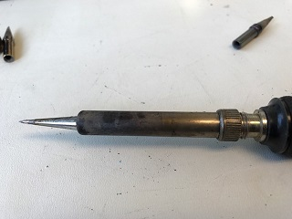

3. Remove the metal sheath holding the tip of the soldering iron in place.

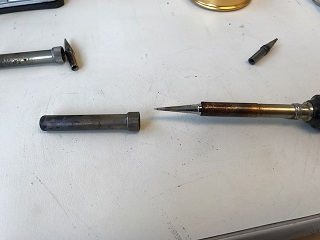

4. Remove and replace the soldering iron tip in the iron with the one you would like to use.

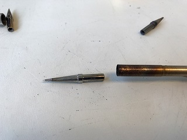

5. Replace the metal sheath and screw the metal ring tightly into place.

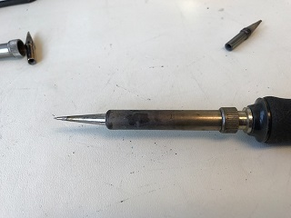

## What Type of Soldering Iron Tip to Use
There are many different types of tips that soldering irons can use. The two most common are the chisel tip and the needle tip.

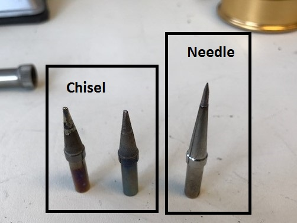

### Chisel tip
The chisel tip for the soldering iron is characterized by its broad, flat shape. This results in a high surface area for heat from the tip to flow into its surroundings. The chisel tip is best suited for desoldering as well as for soldering medium to large components, as it is able to heat up components and solder relatively quickly. The large size of the chisel tip makes soldering small components, such as SMD resistors or chips, difficult.
### Needle tip
The needle tip for the soldering iron has a small, pointed shape, much like that of a needle. This small area allows for the heat from the soldering iron to be precisely directed. The result is that the needle tip is very good for soldering very small parts or making changes to joints that have already been soldered. The small tip is not well suited to desoldering or soldering joints which require an excess amount of solder. *Needle tips are fragile, trying to push them closer to the board using force will not help lead the heat better, but simply bend the tip. Instead, apply solder to lead the heat!*

## Soldering Chips
### DIP (Dual Inline Package) chips
When making prototypes with DIP chips, it is not advisable to solder the chip directly to the solderboard or PCB. Instead, you should use a DIP socket and solder that to the solderboard or PCB instead. This allows for you to remove the chip and use it in another project later or replace it if it is broken. DIP sockets can be soldered into place like any other through hole component, though some tape may be needed to hold the socket in place.
### SMD (Surface Mount Device) chips
SMD chips are often significantly smaller than their DIP counterparts, and require more precision when soldering. It is often best to use the needle tip for soldering these types of chips and devices. The best strategy for soldering a SMD chip is to lay your PCB flat and focus on soldering one pin to its corresponding pad. After one pin is soldered, you can then move the board to an easier orientation to solder. Soldering the remaining pins must be done carefully, applying as little solder as needed to make a good connection. One way to solder chips with many pins is to apply small globs of solder on to a group of pins, then soak up a small amount of that solder with braid. This should get rid of the excess solder, but keep the individual pins soldered to their corresponding pads.
## Solder Size
Like wires, solder comes in different gauges. Higher gauge solder allows for more precise control over how much solder is applied, and is best used soldering SMD chips and parts. Lower gauge solder is better for soldering large components or applying large amounts of solder.

# Good Luck and Happy Soldering!
