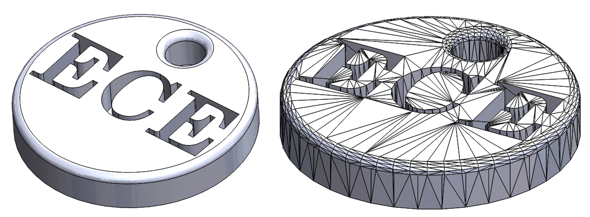

# ECE3400 Fall 2017
## STL-files briefly explained
*By Kirstin Petersen, August 9th 2017

A STL file describe the surface geometry of a 3D object. It does this using a series of triangles described via the unit normal and vertices in a cartesian coordinate system. STL-coordinates are always positive numbers, there is no scale information and the units are arbitrary. When the STL file is used for 3D printing, it must represent an enclosed 3D volume, that is not self-intersecting, and where every edge is part of exactly two triangles. When it is used simply for illustrative purposes, these properties do not need to be enforced. STL files can be saved in both ASCII and binary representations - the latter is more compact, and so more common. 

For simplicity we will illustrate the contents of an STL-file in ASCII format:

```C
//The file starts with "solid" followed by the name of the part you are creating
solid name_text

//The file continues with any number of triangles, each represented as follows:

facet normal ni nj nk //n is a floating-point number in sign-mantissa-"e"-sign-exponent format, e.g., "2.648000e-002"
    outer loop
        vertex v1x v1y v1z //v is a positive floating-point number in the same format as n
        vertex v2x v2y v2z
        vertex v3x v3y v3z
    endloop
endfacet

//The file ends with the opposite of the starting command
endsolid name
```

The triangle described in the file above, could for example be part of a square as illustrated in the figure below:


NB: The order of the vertices is determined by the right-hand rule. I.e. if you point your right thumb in the direction of the normal vector, the vertices are number ascendingly along the direction of your other four fingers.

When you save your 3D part in an STL-file most programs will let you choose the resolution. With the low-end 3D printers we are using in this class a course resolution (angle tolerance ~30degrees, deviation 0.05mm), which leads to much smaller file sizes, is typically enough. 



